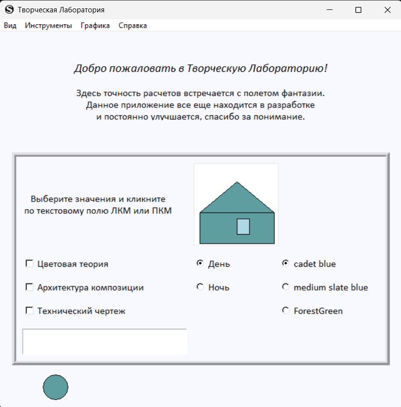
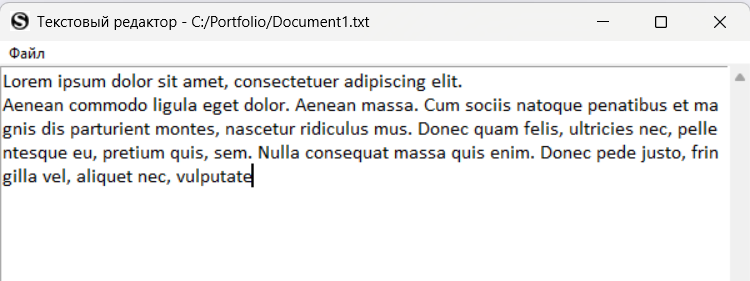
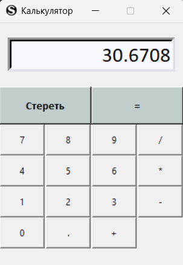
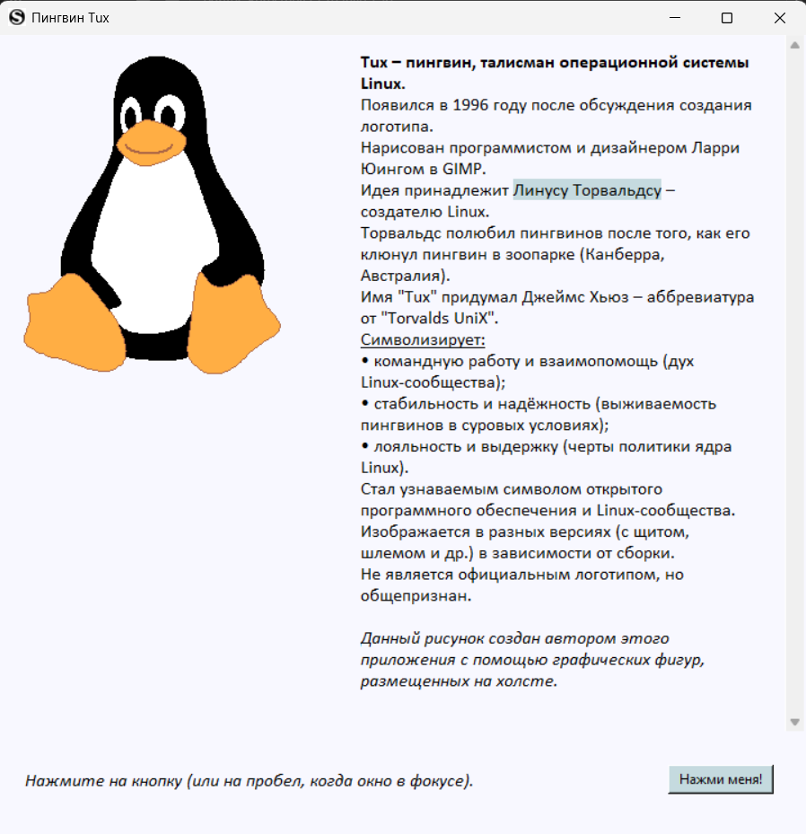

# Tkinter_Berestneva_Creative_Lab

Инструмент для подбора гармоничных цветовых палитр и творческих экспериментов на базе библиотеки Tkinter.

## 📌 Описание
«Творческая Лаборатория» — это многофункциональное графическое приложение, разработанное на Python с использованием библиотеки Tkinter. Проект объединяет в себе инструменты для работы с текстом, вычислениями, базовой графикой и визуализацией, предоставляя пользователю удобную среду для экспериментов и творчества.

## 🛠 Технологии
- Python 3.x
- Tkinter (стандартная библиотека GUI)

## 🚀 Как запустить
1. Клонируй репозиторий:

```bash
git clone https://github.com/SofyaBerestneva/Tkinter_Berestneva_Creative_Lab.git
cd Tkinter_Berestneva_Creative_Lab
```
2. Запусти программу:

```bash
python main.py
```

При первом запуске автоматически создастся файл `contacts.db`.

## 📂 Структура проекта
| Файл | Описание |
| :--- | :--- |
| `main.py` | Точка входа в приложение, сборка главного окна |
| `graphic_menu.py` | Логика разделов «Графика» (рисование, анимация, Tux) |
| `tools_menu.py` | Реализация инструментов (калькулятор, редактор) |
| `spravka_menu.py` | Логика окна «Справка» |
| `config.py` | Настройки темы, цветов и глобальных констант |
| `ABOUT_TUX.txt` | Текстовый файл с историей и интересными фактами о Tux |

## 🚀 Основные возможности
- **Инструменты**: Встроенный калькулятор и текстовый редактор для быстрых заметок.
- **Графическая лаборатория**: 
  - Работа с графическими примитивами (схемы шифрования).
  - Анимация объектов и работа с цветом.
- **Интерактив**: Возможность переключения тем (светлая/темная) и доступ к интересным фактам об искусстве.

## 📸 Скриншоты
### Главное окно

***
### Текстовый редактор для быстрых правок и создания файлов

***
### Калькулятор для базовых расчетов

***
### Отрисовка Tux стандартными примитивами Canvas

***

## ✨ Особенности
- Использованы только стандартные примитивы (create_oval, create_polygon, etc.).
- Интерфейс адаптирован под творческую работу.

---
Автор: [SofyaBerestneva](https://github.com/SofyaBerestneva)